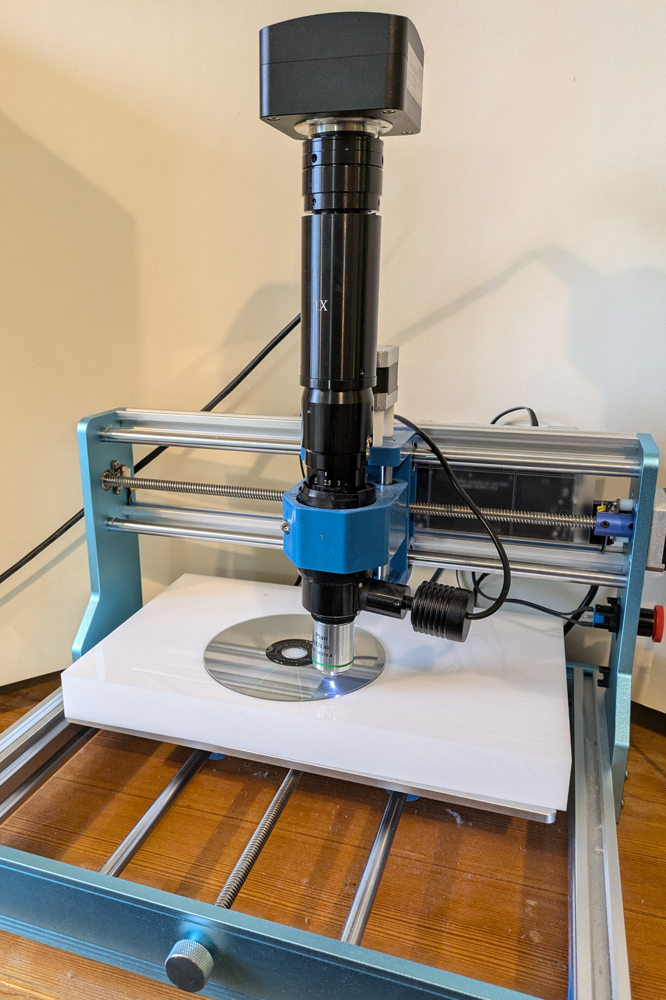

# cncmicroscopy

Initial work on controlling a CNC machine, with a microscope attached.

Making use of an AmScope C-Mount camera attached to the metallurgical style microscope.

See https://www.anfractuosity.com/projects/cnc-microscopy/ for further information.

* jog.py - Simple CLI tool to jog microscope about
* microscope.py - Scans across sample, capturing images
* stitch.py - Script to generate ImageJ macro used to initiate stitching
* sharpness.py - Generates heatmap showing sharpest areas of image

